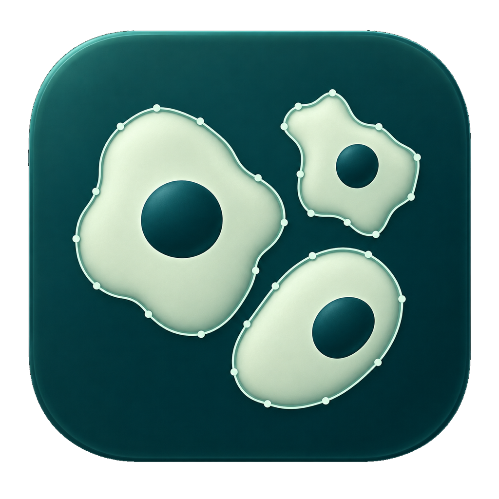
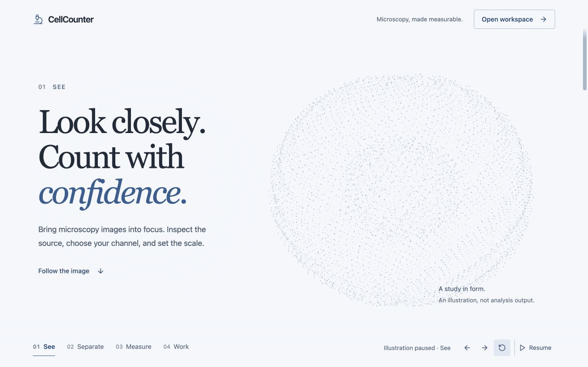

<div align="center">

# CellCounter



Private cell quantification for microscopy images.
Segmentation, per-cell measurements, assays, correction, and export on macOS, Windows, and the web.

[](https://github.com/Alperen-Gur/CellCounter/releases/tag/v1.0.13)
[](https://github.com/Alperen-Gur/CellCounter/releases/tag/windows-v1.1.0)
[](https://github.com/Alperen-Gur/CellCounter/releases/tag/web-v0.2.1)
[](https://github.com/Alperen-Gur/CellCounter/actions)
[](LICENSE)

[Platforms](#platforms) · [What it does](#what-it-does) · [Complete feature list](docs/FEATURES.md) · [Quick start](#quick-start) · [Limitations](#statistical-notes-and-limitations) · [Citing](#citing)

For interface work, see the [design library](docs/design/README.md): a reusable design reference, expanded resource catalogue, sourced critique, Astra guidance, and the CellCounter application brief.

</div>

---

CellCounter turns microscopy images into reviewable cell masks, measurements, size distributions, and assay
results. It supports counts, size classes, marker-positive fractions, colocalization, confluence, wound closure,
foci per cell, migration, and more through a focused graphical interface.

These analyses are usually done with an ImageJ macro or a CellProfiler pipeline. CellCounter does them through
a graphical interface instead. It applies to any cell type a supported model can segment.

Image analysis is local by design. CellCounter does not require an account and does not upload microscopy images.

## Platforms

| Platform | Release | Availability |
|---|---|---|
| **macOS** | [v1.0.13](https://github.com/Alperen-Gur/CellCounter/releases/tag/v1.0.13) | Native universal app for macOS 15 or later |
| **Windows** | [v1.1.0](https://github.com/Alperen-Gur/CellCounter/releases/tag/windows-v1.1.0) | Native x64 `.exe` and `.msi` installers for Windows 10 and 11 |
| **Web** | [v0.2.1 preview](https://github.com/Alperen-Gur/CellCounter/releases/tag/web-v0.2.1) | Installable PWA with local classical segmentation; learned models remain unavailable |

> [!NOTE]
> The web preview keeps images in the browser and runs classical threshold/watershed segmentation, but its three
> learned segmentation models are not bundled yet. Use the macOS or Windows app when live model inference is
> required. Platform-specific details are available in the [Windows guide](docs/WINDOWS.md) and
> [web guide](docs/WEB.md). See the [complete feature list](docs/FEATURES.md) for a release-by-release comparison.

**Feature parity is partial.** All three platforms now provide saved setup, preview, resumable processing,
linked measurements, and mask review. Windows retains three CPU-only learned models; the PWA currently runs
classical segmentation. The broader model catalog, microscopy workspace and several correction/training tools
remain macOS-specific. See [release status and remaining parity gaps](docs/PLATFORM-PARITY.md) for the current
inventory and confirmation status of the two reported desktop issues.

## New in Web v0.2.1 preview

A neutral, muted-blue workbench replaces the crowded interface. Preview and process with local classical segmentation, recover saved jobs, and review linked measurements or mask alternatives. A continuous, full-page 3D introduction follows the scroll from cell-like forms to an ordered field, with rotation, pause and reduced motion; library icons replace bespoke interface marks. See the [web release notes](docs/releases/web-v0.2.1.md) and [design guide](docs/design/cellcounter-guide.md).



## New in Windows v1.1.0

The first-analysis **“Sidecar scripts are not staged”** error is fixed. Import into a saved setup, preview before processing, pause/resume jobs, and inspect linked measurements or saved mask versions. Large Review Queues use bounded pages and support Undo across pages. See the [Windows release notes](docs/releases/windows-v1.1.0.md) for training requirements, unsigned installer guidance and remaining platform gaps.

## New in macOS v1.0.13

Large Review Queues use bounded contour caches and stable pages. Skip reaches every candidate, previews follow the current card, and saved edits plus undo remain reliable across pages. This addresses [issue #9](https://github.com/Alperen-Gur/CellCounter/issues/9), reported after processing hundreds of images. See the [release notes](docs/releases/v1.0.13.md).

## New in macOS v1.0.12

- Ordinary PNG, JPEG and BMP source previews use native decoding before Python startup; unsupported scientific layouts retain their source reader.
- Analysis setup starts with a valid image selection, keeps its preview visible while preparing a channel, and avoids redundant image reloads.
- First-use Cellpose weight downloads show progress and actionable network errors. Missing calibration metadata is explained separately from image or model failures.

See the [hotfix release notes](docs/releases/v1.0.12.md).

## New in macOS v1.0.11

macOS v1.0.11 introduced the native **inspect → preview → process → review** workflow.
Windows and the web have separate releases with the differences listed in the feature reference.

- The Models page shares background availability checks instead of repeating runtime imports on first navigation.
- Screen-aware keyboard commands appear in the menus and in **Help → Keyboard Shortcuts** (`⌘/`), with standard
  text editing preserved. A new microscopy icon is included in the macOS app assets.
- Import and inspect before installing a detector; choose a representative image and preview masks before a batch.
- Keep processing in a persistent queue, browse completed images, pause after the current image, resume after
  relaunch, and retry failures without repeating successful images. Interrupted work waits for you to resume.
- Select the same cells in an image, measurement table, or scatter plot; compare saved mask variants with linked
  pan/zoom and added, removed, and changed outlines.
- Start from cell counting, nuclei, marker positivity, or wound-closure tasks. Each result retains its original
  analysis settings; current calibration and review filters are shown separately.
- Train Cellpose 3.x from explicitly reviewed library masks, keeping specimen groups together across training,
  validation, and held-out evaluation. Activation requires a real checkpoint and a verified evaluation report.
- Reuse warm assay workers and bounded source/mask caches; draw visible masks using cached paths. Prepare the
  next source only within a conservative memory budget while model inference remains serial.

See the [release notes](docs/releases/v1.0.11.md) and [native workflow details](docs/FEATURES.md#macos-v1011-workflow) for supported behavior and limits.

## Why it exists

Cellpose provides its own graphical interface, and CellCounter does not replace it. It covers requirements the
general-purpose tools do not provide directly:

| | |
|---|---|
| **Installation without environment setup** | The installer sets up the Python environment in the background. There is no conda, pip, or PATH configuration. |
| **Size classes in addition to masks** | Cells are binned into size categories in micrometres, using a pixel size read from the image metadata. |
| **Assays in addition to counts** | Marker-positive fraction, colocalization, confluence, wound closure, foci per cell, and others. |
| **Local processing** | Analysis remains on the device, helping laboratories keep sensitive image data under their own control. |

## What it does

### Segmentation

The macOS app offers the full set of model families summarized below. Windows v1.1.0 focuses on three validated families:
Cellpose-SAM (legacy `cpsam_v2` ID), Cellpose `cyto3`, and StarDist fluorescence. The web preview exposes the same three-model catalog,
with learned inference clearly marked unavailable until validated browser weights are distributed.

| Model | Best for |
|---|---|
| **Cellpose-SAM** | Large or irregular cells — where `cyto3` merges neighbours into one mask |
| **Cellpose** `cyto3` `cyto2` `nuclei` | General cytoplasm and nuclei |
| **StarDist** | Crowded, roughly convex nuclei |
| **Omnipose** | Bacteria and elongated / filamentous cells |
| **Threshold + watershed** | No weights, no download, no GPU — instant and deterministic |
| **Your own model** | Load a fine-tuned Cellpose checkpoint or a StarDist model directory |

Plus a **second-opinion** mode: run two detectors and review only the cells where they disagree.
The macOS catalog also includes Cellpose-SAM v2, Cellpose-DINO ViT-L and ViT-B, multiple StarDist and Omnipose
checkpoints, and Otsu, triangle, adaptive, and manual threshold variants. Models that are still being validated
are marked as unavailable in the application rather than presented as runnable.

### Images

The native apps read JPEG, PNG, BMP, TIFF / OME-TIFF, and common microscope containers. macOS supports Zeiss
`.czi`, Nikon `.nd2`, Leica `.lif`, and Olympus `.oif` `.oib` `.oir`; Windows supports `.czi`, `.nd2`, `.lif`,
`.oir`, and `.vsi`. macOS offers max, sum, and mean **Z-stack** projections plus channel selection and naming;
Windows analyzes a chosen channel with maximum, mean, sum or middle-plane projection; its setup viewer still shows the imported display preview. The web preview supports JPEG, PNG,
WebP, BMP, TIFF, and OME-TIFF; proprietary microscope containers should be converted locally to OME-TIFF first.

Calibration can be read from compatible OME, ImageJ, TIFF, and microscope metadata or entered manually from a
known pixel size or scale bar. Named calibration presets, configurable size bins, and analysis protocols make
the same settings reusable across a study.

### Microscopy workspace on macOS

The macOS app includes a native, layer-based workspace for exploratory image analysis and presentation:

- Browse multidimensional time, Z, and channel axes without loading an entire sequence into memory.
- Open local OME-Zarr / OME-NGFF multiscale datasets and plates, with automatic resolution selection.
- Align image layers, create bounded-memory tile mosaics, and build or manually correct cell lineages.
- Paint class labels and export 16-bit training masks for use with a separate model-training workflow.
- Record repeatable local workflows for layer, axis, registration, and stitching operations.
- Save and reopen workspace projects, control layer visibility and opacity, and create keyframed GIF animations
  of axis, camera, visibility, and opacity changes.

Workspace projects and images stay on the Mac. The extension browser exposes only bundled, curated capabilities;
it does not download or execute third-party plugin code.

### Measurements and assays

<table>
<tr><td valign="top" width="50%">

**Per cell**
- Area, perimeter, equivalent diameter
- Circularity, aspect ratio, solidity, eccentricity
- Per-channel intensity
- Size class

</td><td valign="top" width="50%">

**Per image**
- Counts, per-bin counts, size histogram
- Confluence (% area covered)
- Colony counts
- Nearest-neighbour distance, density, clustering index

</td></tr>
<tr><td valign="top">

**Fluorescence**
- % marker-positive (Ki67, EdU, BrdU, caspase)
- Transfection efficiency
- Nuclear:cytoplasmic ratio
- Colocalization — Pearson, Manders M1/M2
- Live/dead, cell-cycle from DNA content
- Puncta / foci per cell

</td><td valign="top">

**Time series & morphology**
- Scratch / wound-healing closure
- Cell tracking — speed, directionality
- Spheroid and organoid size
- Neurite length per cell

</td></tr>
</table>

### Review and analysis workflow

- **Library and batches** — browse imported images, organize conditions, inspect batch summaries, and find exact duplicates.
- **Focused review** — triage low-confidence detections, attach per-image notes and review confidence, and keep correction history with undo and redo.
- **Image inspection** — switch channels and Z projections, inspect intensity histograms and calibrated line profiles, and apply include/exclude regions of interest.
- **Quality control** — review focus and illumination indicators, confidence and diameter distributions, drift, detector agreement, and fields ranked for attention.
- **Detection refinement** — adjust confidence and expected diameter, use preprocessing presets and background subtraction, split touching cells, and rerun detection without losing the source image.

### Fine-tuning and model history

Windows v1.1.0 supports local Cellpose `cyto3` fine-tuning with a held-out test split, progress and cancellation,
versioned checkpoints, and explicit activation. macOS v1.0.12 trains compatible Cellpose 3.x models from reviewed
library masks, keeps independent specimen groups in separate train/validation/test partitions, and evaluates
the selected checkpoint on held-out images. Training requires at least three specimen groups and six epochs;
checkpoint activation checks the saved evaluation report and weight-file hash. Version history supports rollback.
The web preview does not train models; corrected label masks and ROI data can be exported for later workflows.

### Correction, comparison, export

- **Manual correction** — add, delete, merge, split, resize, or trace a cell by hand. Corrections persist and the exported count is the corrected count.
- **Prompt-guided correction** — refine a mask with a point or box prompt. Compatible `micro_sam` installations reuse per-image embeddings; a native local fallback remains available.
- **Sequence correction** — propagate selected masks, interpolate labels between frames, and compensate acquisition drift before tracking.
- **Fast curation** — review uncertain detections as cards or a tiled grid, compare reversible mask variants, and rank fields by heuristic error risk.
- **Quality insights** — cached confidence/diameter plots, drift trends, detector agreement, and preprocessing recommendations are recomputed only when a batch changes.
- **Compare** two conditions with a Mann-Whitney U test and effect size — read the [limitations](#statistical-notes-and-limitations) first.
- **Score against ground truth** — F1, precision, recall vs. your own hand counts.
- **Export** — PDF reports, annotated images, per-cell CSV, per-image summary CSV with one column per size bin, ImageJ ROI sets, GeoJSON (QuPath), and reproducibility metadata. macOS can also export ground-truth annotations and create a self-contained sample folder containing the source, overlay, tables, ROIs, Markdown and PDF reports.
- **Analysis protocols** — save model, diameter, bins and calibration to a file so a whole lab runs identical settings.
- **Duplicate detection** (SHA-256) so the same field is never counted twice.

### Large batches

CellCounter opens large libraries progressively, keeps previews and masks within a bounded working set, and
moves expensive analysis away from the interface. Browsing and review remain responsive without loading every
full-resolution image at once.

The [complete feature list](docs/FEATURES.md) records the public functionality available in each released
edition, including platform adaptations, preview features, and intentional limitations.

## Install

### macOS — current release

[](https://github.com/Alperen-Gur/CellCounter/releases/tag/v1.0.13)

Requires **macOS 15 or later**. Universal binary (Apple silicon and Intel).

1. Download `CellCounter-v1.0.13.zip` from the [macOS release](https://github.com/Alperen-Gur/CellCounter/releases/tag/v1.0.13).
2. Unzip and move **`CellCounting.app`** into Applications.
   *(The application is called CellCounter; the bundle on disk is still named `CellCounting.app`.)*
3. The app is not notarized, so the first launch is blocked. Open **System Settings → Privacy & Security**, scroll to the bottom, and click **Open Anyway**. Full walkthrough: [docs/INSTALL.md](docs/INSTALL.md).
4. Import images to inspect them immediately. When ready to detect cells, install a model from **Models**,
   return to **Analysis setup**, preview a representative image, then process the batch. Vendor formats need
   their compatible Python reader before import.

<details>
<summary>macOS says the app is "damaged"</summary>

This message normally means Gatekeeper has blocked the ad-hoc-signed, quarantined download. Confirm that the archive
came from the official release, move the app to Applications, and run:

```bash
xattr -cr /Applications/CellCounting.app
```

Then open it normally.
</details>

### Windows — current release

[](https://github.com/Alperen-Gur/CellCounter/releases/tag/windows-v1.1.0)

Requires **64-bit Windows 10 or Windows 11**. Choose the `.exe` for a standard workstation installation or the
`.msi` for managed deployment. Both contain the same native application.

The installers are currently unsigned, so Windows SmartScreen may show an unknown-publisher warning. Verify the
download against the supplied `SHA256SUMS.txt` before continuing. The application provides three local model
families: Cellpose-SAM v2, Cellpose `cyto3`, and StarDist fluorescence. See the
[Windows installation guide](docs/WINDOWS.md) for model setup, upgrades, backup, and troubleshooting.

### Web — private PWA preview

[](https://github.com/Alperen-Gur/CellCounter/releases/tag/web-v0.2.1)

The web edition is a fully client-side PWA with no account, upload, telemetry, or application server. Download
the release archive and serve it from HTTPS or `localhost`, then install it from a current WebGPU-capable browser.
Its browser-native import, curation, measurement, assay, and export tools are available offline after installation.

Production model weights are not included in v0.1.0, so learned segmentation is intentionally unavailable in
this preview. See the [web guide](docs/WEB.md) for supported formats, browser requirements, and current limits.

## Quick start

For macOS v1.0.13:

1. Open images with **⌘O**, or a folder with **⌘⇧O**. Choose a representative image in **Analysis setup**.
2. Choose a task and model; confirm the pixel size and source channels. Install the model from **Models** if needed.
3. Choose **Preview this image** to inspect masks, then **Process batch**. Use **Import and inspect** to defer detection.
4. Open **Processing** to pause, resume, retry failures, or browse completed images. Review linked image/table/plot selections and correct masks.
5. Compare saved mask variants, use **Compare** for two conditions, or export a PDF, CSV, ROI set or GeoJSON.
6. Open **Help → Keyboard Shortcuts** (**⌘/**) for the available commands.

See the [Windows guide](docs/WINDOWS.md) and [web guide](docs/WEB.md) for their respective workflows.

## Privacy and local processing

Native analysis runs on the computer where CellCounter is installed. The web edition processes imported images
inside the browser. CellCounter has no image-upload or remote-inference path in these releases. Network access is
used only when the operating system or user requests supporting software or model files; microscopy images are
not included in those requests.

## Statistical notes and limitations

> [!IMPORTANT]
> CellCounter is a measurement tool; its built-in statistics are for exploration. Read this before a number
> from it goes into a paper.

<details>
<summary><strong>The replication unit is the biological replicate, not the cell</strong></summary>

The Compare tab's Mann-Whitney U test pools every individual cell across all images in a condition and treats
them as independent. For condition-level inference this is pseudoreplication: it inflates n by orders of
magnitude and returns very small p-values for biologically trivial differences.

For publication, aggregate first. Export the per-cell CSV, compute one summary per image (or per patient, or
per well) — for example the median diameter — and test on those replicate-level values, or use a mixed-effects
model with image or patient as a random effect. Treat the in-app pooled test as descriptive only.
</details>

<details>
<summary><strong>No multiple-comparison correction</strong></summary>

Comparing more than two conditions by re-selecting pairs gives uncorrected p-values and significance markers.
Apply Holm or Benjamini-Hochberg (or an omnibus Kruskal-Wallis first) when reporting several contrasts.
</details>

<details>
<summary><strong>Segmentation is not bit-for-bit reproducible across machines</strong></summary>

Counts depend on the model version, the device (GPU or CPU), and the PyTorch and NumPy versions. Expect small
run-to-run and machine-to-machine differences. For a reproducible methods section, record the model, the app
version and the resolved dependency versions — the exported provenance sidecar captures model, calibration and
parameters.
</details>

<details>
<summary><strong>"Size" is an equivalent diameter</strong></summary>

Each cell's size is the diameter of a circle with the same segmented area (`2·√(area/π)`) — a shape-agnostic
proxy, not a measured long or short axis. Per-cell "confidence" is a monotonic transform of Cellpose's
cell-probability, not a calibrated probability.
</details>

<details>
<summary><strong>Assay results are withheld rather than guessed</strong></summary>

Where a number cannot be produced honestly the app says so. For example, % marker-positive is withheld when the
population shows no evidence of two distinct groups — an automatic threshold will otherwise split a single
uniform population and report a confident, meaningless percentage.
</details>

## A note on the name

Several tools share the name "Cell Counter". This project is not affiliated with, and is distinct from, the 2014
application *CELLCOUNTER: Novel Open-Source Software for Counting Cell Migration and Invasion In Vitro* (BioMed
Research International, for Boyden-chamber assays) and the ImageJ / Fiji **Cell Counter** plugin (manual tally
counting). CellCounter here is a Cellpose-driven counting and size-classification desktop application.

## Citing

If CellCounter is useful in your work, please cite it (see [CITATION.cff](CITATION.cff)) **and** the segmentation
model you ran:

- Stringer, C., Wang, T., Michaelos, M., & Pachitariu, M. (2021). Cellpose: a generalist algorithm for cellular segmentation. *Nature Methods* **18**, 100–106.
- Pachitariu, M., & Stringer, C. (2022). Cellpose 2.0: how to train your own model. *Nature Methods* **19**, 1634–1641.
- Using `cyto3 + restore` or Cellpose-SAM? Also cite the Cellpose 3 and Cellpose-SAM papers listed in the [Cellpose repository](https://github.com/MouseLand/cellpose).
- Using StarDist or Omnipose? Cite their papers too.

## Built on

[Cellpose](https://github.com/MouseLand/cellpose), [StarDist](https://github.com/stardist/stardist), and
[Omnipose](https://github.com/kevinjohncutler/omnipose) provide learned segmentation families. PyTorch, NumPy,
SciPy, scikit-image, tifffile, and format-specific readers support the native analysis pipeline. Full inventory
and licenses: [THIRD_PARTY_LICENSES.md](THIRD_PARTY_LICENSES.md).

## License

MIT — see [LICENSE](LICENSE). Contributions welcome; see [CONTRIBUTING.md](CONTRIBUTING.md).
