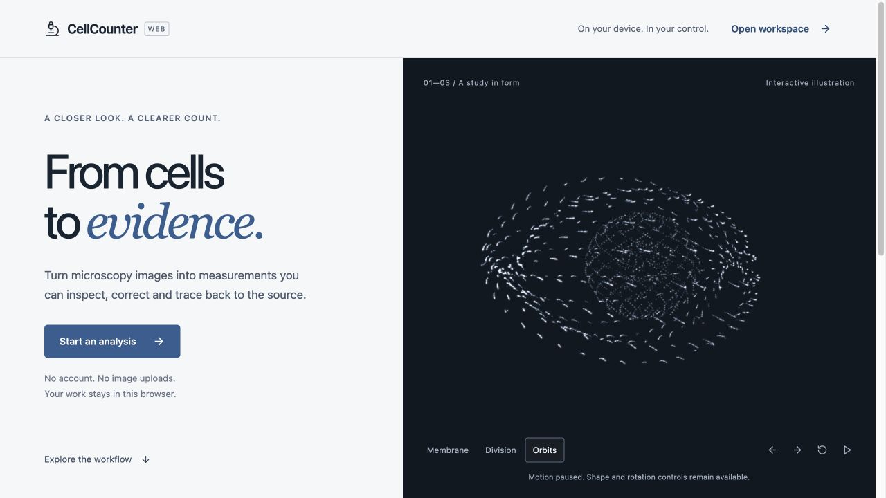
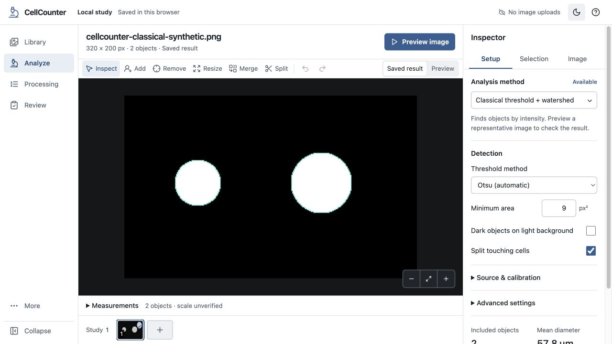

# CellCounter interface direction

Design brief and implementation guidance · 8 September 2026. The guide preceded the redesign; the implementation record below identifies what has since been observed. Publication status is recorded in the release notes. Use with the [general reference](../design-reference.md), [resource catalogue](../resource-catalogue.md), [systems research](research/systems-evidence.md), and [critique research](research/critique-evidence.md).

## The job

CellCounter helps a researcher import microscopy images, inspect the source, configure and preview analysis, process a batch, review individual objects, and export measurements they can trace back to the source and settings. The working surface should make the image and its interpretation easy to see for extended sessions. The application is primarily an **Operate** surface; documentation is **Read** and the download website is **Persuade**. These modes are adapted from [Impeccable’s context guidance](https://impeccable.style/docs/context/).

The product character is precise, calm, and visibly scientific. Establish it through a generous image canvas, excellent typography, a coherent measurement vocabulary, restrained color, and direct manipulation. An attractive shell is useful when it makes the evidence easier to inspect.

## What is wrong with the current PWA

These are expert observations from the development build on 8 September 2026, not user-study results. The inspected screen used the existing synthetic cell fixture. No real microscopy image was uploaded or published. Values describe one rendered state at **1280 × 720**, not every viewport or image.

| Observed problem | Evidence | Consequence | Design response |
| --- | --- | --- | --- |
| The image is squeezed between interface panels | The central stage measured **862 × 215 CSS px**; the processing block above it was **150 px** high | Only about 30% of viewport height is devoted to the primary visual task | Give the viewer the remaining work area; move batch detail into a dedicated view and measurements into a deliberate drawer |
| Action hierarchy is ambiguous | Toolbar `Preview`, panel `Preview whole image`, `Show preview`, `Process image`, `Process all`, and `Review results` are visible together | The user must decode execution, display state, and navigation at the same time | One contextual primary action; keep preview/result viewing in a separate labeled switch |
| Text is too small and too uniformly subdued | Navigation labels render at **9 px**, image metadata at **11 px**; styles include many 7–10 px labels | The UI feels miniaturized, and meaningful distinctions depend on close inspection | Adopt readable role-based type sizes and reserve muted text for genuinely secondary information |
| The inspector exposes several stages of work simultaneously | Source setup, parameters, validation, regions, notes, and export share one tall scrolling column | First-use setup looks as complex as advanced correction work | Separate Setup, Selection, and Image information by task context; use advanced disclosure within each |
| Developer concepts occupy product navigation and copy | `Parity` is a primary destination; Models says `WebGPU catalog`, `Validated build pending`, `Checksum-first by design` | Researchers encounter implementation status before knowing what they can do | Put support details in Help/About and use available/unavailable model states with a practical next step |
| Layering creates visual noise | Several rounded bordered panels, floating editing tools, pill states, faint grid, and accent treatments compete | The specimen and selected object lack clear visual priority | Use one pane structure, rules for grouping, and a small number of meaningful surfaces |
| Mobile inspector behavior is implicit | The current mobile CSS reveals the inspector on `:hover` or `:focus-within` | A touch user has no explicit open/close action; behavior depends on focus and hover emulation | Provide an actual labeled button and dismissible sheet, with predictable focus restoration |

Implementation references: [workspace composition](../../web/src/App.tsx), [layout and typography](../../web/src/styles/app.css), [processing panel](../../web/src/components/ProcessingPanel.tsx), [inspector](../../web/src/components/Inspector.tsx), and [model page](../../web/src/views/ModelsView.tsx). These links intentionally refer to the evolving implementation; the measurements above are a dated baseline.

## Art direction: a research workbench

Use Swiss-influenced alignment, typographic order and disciplined grouping, adapted to an interactive instrument. Keep the specimen visually dominant. Use explicit conventional controls and platform-appropriate focus/keyboard behavior. This is our application of the sources, not a historically prescribed Swiss software layout. See the [Swiss, Apple and neumorphism evidence](research/systems-evidence.md).

| Element | Proposed decision | Why |
| --- | --- | --- |
| Canvas | Neutral near-black surround in both themes; optional plain or subtle grid only where orientation benefits | Keep fluorescence colors and masks distinct from application branding |
| Light chrome | Neutral white and cool gray surfaces, dark text, crisp separators | Avoid the muddy combination of warm paper tones and low-contrast green-gray labels |
| Dark chrome | Neutral charcoal surfaces with a clear text hierarchy | Keep the dark theme distinct from a single green tint applied everywhere |
| Accent | Muted instrument blue: light `#315e91`, dark `#9bb8dc`; no green branding or luminous control treatments | Follow the user’s direction and keep UI color separate from fluorescence data |
| Specimen overlays | Separate palette from chrome; selected object gets an explicit outline/handle treatment and linked row | Application accent must not become the only way to identify a cell against green fluorescence |
| Typography | A dependable system sans stack initially; 14 px normal controls/data, 13 px secondary metadata, 18–22 px section/page titles; tabular figures for measurements | Readability and alignment before adding fonts; exact sizes are project starting points, not accessibility standards |
| Spacing | 4 px base rhythm; 8 px within compact groups, 16 px between related groups, 24 px between sections | Use space to express relationships instead of repeatedly outlining boxes |
| Controls | 36–40 px desktop control height; larger touch targets in touch layouts; 6–8 px control corners | Consistent hit areas and visual weight without soft, pillow-like controls |
| Depth | Borders and surface contrast for permanent panes; shadow for transient menus/dialogs | Make elevation reflect interaction, rather than decorate every section |
| Motion | Brief feedback in the workbench; an optional, separate particle introduction may support exploration | Keep analysis immediately available and avoid continuous decorative rendering during image work |

Neumorphic styling may suit an isolated illustration or a nonessential status ornament. It should not carry the only boundary, selected state, or focus indication for analysis controls. Apple-style translucency belongs only where foreground controls stay readable over changing specimens; an opaque surface is the default here. This is a contextual decision, not a ban on either visual language in other products.

## Visual contract: no neon, no invented icons

This section incorporates the user’s explicit direction on 8 September 2026
before the revised palette and particle scene are implemented.

- Use white/cool-gray chrome, charcoal text and a muted blue accent. Dark mode
  uses neutral charcoal, pale gray text and a desaturated blue accent. Remove
  green-tinted backgrounds, neon green branding, luminous status pills and
  glow around ordinary controls. A fluorescence image’s green pixels are data,
  not application styling, and must remain unchanged.
- Use the existing **Lucide** icon library consistently, including the small
  microscopy brand mark. Do not draw new CSS/SVG icons. Any future bespoke
  raster branding should use image generation or appropriately licensed assets,
  with provenance and license recorded. Lucide’s ISC license permits use,
  modification and distribution with its notice retained.
  [Lucide license](https://lucide.dev/license).
- The particle scene is a scientific-inspired illustration, not a specimen,
  measurement, simulation result or claim about cellular mechanics. Label it as
  an illustration. Never synthesize apparent analysis output to decorate an
  empty result.

### Optional interactive introduction

The user likes movable 3D point clouds, shape morphing, orbital fields,
procedural motion, depth cues, additive light and scroll-linked transitions.
Use those capabilities on a dedicated **Welcome** surface. The proposed default
is a first-visit introduction with an immediate **Open workspace** action;
returning projects should reopen their work. Placement can change if the user
chooses a separate landing page. Do not put the animated scene behind specimen
images, tables or analysis controls.

The composition should pair a concise, left-aligned product statement with a
large, dark-neutral 3D viewing area. White, steel-blue and a small amount of
muted violet distinguish the point structures; no neon green or rainbow
spectrum. The illustration morphs among a membrane-like cloud, a divided
cluster and orbital paths around a core. It uses restrained soft light rather
than a blown-out white center. Exact camera angles and particle distributions
are art-direction choices, not scientific models.

Required behavior:

1. Pointer dragging rotates the actual 3D view. Arrow-key controls or visible
   buttons provide the same ability; scrolling the introduction changes morph
   state, with labeled shape buttons as a direct alternative.
2. Include visible pause/resume and a direct exit to the workspace. Honor
   `prefers-reduced-motion`: show a static selected shape, disable scroll-driven
   motion and automatic orbit, and allow explicit shape changes.
3. Load the renderer only for this surface. Cap particle count and pixel ratio;
   pause when hidden or offscreen and dispose GPU resources on exit. The
   illustration must not delay importing or decoding microscopy images.
4. Use real depth-based point size, bounded additive blending and soft particle
   falloff. Smooth morphs may use a procedural curl field; do not describe a
   simple linear tween as a fluid simulation.
5. A WebGL failure leaves readable content and the workspace action available.
   It must not prevent using the PWA’s classical analysis method. Record the
   renderer’s license and distinguish observed performance from targets.

## Organize around tasks

Primary destinations: **Library, Analyze, Processing, Review**. Place assays and comparisons where they act on selected images or results; retain direct access through menus/search if needed. Models and Settings are utilities. Product capability documentation belongs in Help, with developer mappings in repository docs.

| Surface | Primary decision/action | Layout and secondary information |
| --- | --- | --- |
| Empty library | Import images | One clear import area, supported formats and local-storage explanation; no inactive analysis dashboard |
| Library | Choose images to analyze | Readable list or thumbnail grid, search/filter, selection count, status; expose batch setup after selection |
| Analyze: setup | Preview this image | Large viewer, concise setup inspector, source/channel/plane and calibration context; advanced parameters disclosed |
| Analyze: preview | Accept settings and process selection | Explicit `Preview` badge and result count; show whether current settings match the preview; preserve access to the saved result |
| Processing | Understand progress or recover a job | Job list, completed/failed/remaining counts, current image, pause after current image, retry failed; no giant viewer competing with the queue |
| Analyze: saved result | Inspect or correct an object | Viewer plus selection measurements; tools beside the canvas; versions and recorded settings available on demand |
| Review | Keep, reject, resize, or skip the current candidate | Consistent crop context, neighboring candidates as needed, keyboard help on demand, durable undo and visible progress |
| Models | Choose an available method | Explain what can run here and what must be installed or is unavailable; details disclose size/source/runtime |
| Export | Choose scope and format | Current image vs selected batch, included/excluded objects, units, destination and completion feedback |

Do not invent a workflow capability while redesigning it. Learned models, training, and some microscopy formats remain browser limitations in the current implementation. Use accurate availability copy and link to a working platform option only when it exists.

## Workspace proportions and density

At 1280 × 720, use a viewer-first composition with a compact application bar, one task toolbar and one contextual inspector. Aim for at least **420 px of unobscured viewer height** in the standard analysis state. This is a proposed project target, not a claim about the current build or a universal percentage rule. Long filenames should wrap/truncate in their own area and remain available in a tooltip or details view, without shrinking controls.

Use an explicit sidebar collapse control. Keep primary navigation names readable at regular widths; do not solve crowding by setting all labels to 9 px. At narrow widths, prioritize the viewer and open settings as a real sheet or separate step. Measurement tables may scroll horizontally in their own region; the overall task and primary action should remain discoverable.

A closed measurement drawer should occupy one labeled bar. When opened, the drawer can take a deliberate portion of the workspace and communicate that tradeoff. Record settings and versions should not consume permanent rows in every ordinary view. Batch status should remain accessible without displaying the full job history above the specimen.

For comparison, [napari documents a central canvas with contextual layer controls and dimension navigation](https://napari.org/stable/getting_started/viewer.html). [QuPath connects selected objects with their measurement lists and exposes calibration as image information](https://qupath.readthedocs.io/en/stable/docs/starting/first_steps.html). These are useful interaction references, not endorsements of copying their complete visual appearance.

## Copy and state contracts

| Current or weak copy | Proposed copy and condition |
| --- | --- |
| `Bring a field of view into focus` | `Import microscopy images` followed by `Drop files here or choose images.` |
| `Inspect → Preview → Process → Review` permanently above the canvas | Use the actual task title and current state. Explain the sequence once in onboarding or setup guidance |
| `Preview · Classical threshold + watershed` | `Preview image`; show the method name as setup context |
| `Validated build pending` | `Not available in this browser version`; provide a real supported alternative if one exists |
| `Checksum-first by design` | Put integrity details under `Model details`; ordinary status says whether the model is ready |
| `Sidecar scripts are not staged` | `The analysis tools could not be prepared.` Add the actual recoverable step and expandable technical details; do not tell users to reinstall unless the failure path warrants it |
| Unqualified `Saved` or `Local only` | Identify storage scope once: `Saved in this browser on this device.` Distinguish saving, saved, failed save, and export; local browser storage is not a backup |
| `Done` after a batch with failures | `28 of 30 images completed · 2 need attention`, with retry scoped to those failures |

The preview must visibly indicate its source image and whether settings have changed since computation. A saved result retains its original run settings even if current form fields change. Unknown calibration stays unknown; a default number must not quietly become a verified measurement scale. Preserve object identity between canvas, table, scatter plot, review and export.

## Accessibility and responsiveness

Aim for WCAG 2.2 AA behavior. Normal text requires at least **4.5:1** contrast and large text **3:1**, with the standard’s exceptions. WCAG’s AA pointer target criterion is **24 × 24 CSS px or compliant spacing**, with specified exceptions; our larger control targets are a usability choice, not a claim that the standard always requires 44 px. [W3C contrast](https://www.w3.org/WAI/WCAG22/Understanding/contrast-minimum.html), [W3C target size](https://www.w3.org/WAI/WCAG22/Understanding/target-size-minimum.html).

Use labels in addition to color for analysis state, selection and failures. Preserve native text-entry keys. Scope single-letter canvas tools to the viewer or its active workspace; do not consume browser/system shortcuts without a deliberate reason. Focus should follow explicit navigation and return after dialogs. Provide a table/list alternative for precise object selection. A hover-only inspector or tooltip-only essential instruction is insufficient for touch and keyboard use.

## Speed is part of the interaction

Show the shell and usable source preview independently of model availability checks. Load expensive code and weights when their task needs them. Keep decoding, inference and large transformations away from the UI thread, cap retained decoded data, render previews at a useful display size, and show honest staged progress. A spinner cannot conceal a blocked event loop.

Core Web Vitals supply broad web targets: LCP ≤2.5 s, INP ≤200 ms, CLS ≤0.1 at the 75th percentile, evaluated separately for desktop and mobile. These are **not measured CellCounter results**. [Google’s Web Vitals guidance](https://web.dev/articles/vitals).

Also record product timings that those metrics do not explain: import to usable image, first model readiness, preview completion, pan/zoom responsiveness, review advance, cancellation response, and memory across a long batch. Label cold/warm cache, image dimensions, format, model, device, browser and sample size. Improve the slow phase demonstrated by evidence; do not claim an attractive skeleton made analysis faster.

## Implementation order

1. Establish semantic type/color/spacing tokens and one control family; remove tiny essential labels and overlapping style overrides.
2. Recompose the analysis workspace around the specimen, contextual inspector and a single action hierarchy. Preserve existing processing and persistence contracts.
3. Simplify navigation and availability/error copy. Make processing its own coherent task surface.
4. Bring library, review, models, export and settings into the same visual system, including empty, loading, error and dense-content states.
5. Review a representative complete workflow at desktop and narrow widths. Exercise changed interactions once with appropriate evidence; honor the user’s request to avoid repetitive full-suite checks.

The current browser parity gaps and unfinished release integration remain separate engineering work. This design brief does not mark them complete.

## Implementation record: Web 0.2.0

The workbench now follows this direction. One production-browser pass at
1280 × 720 measured an **804 × 455 px** analyzed-image stage, compared with the
original **862 × 215 px** stage. Primary navigation renders at **14 px**.
At 390 × 844, the page width remained 390 px, the image stage was 455 px high,
and closing the inspector sheet returned focus to its opening button.

A synthetic two-object image produced a two-object classical preview and saved
result. A waiting update reloaded the app without removing that local study.
These are workflow observations, not biological validation or a full
accessibility audit. The optional Three.js illustration rendered in the
browser; its shape, rotation and pause controls responded, and its canvas was
removed on entering the workspace. Reduced-motion/visibility behavior is
implemented in source; device-wide GPU or frame-rate performance is not claimed.

Licenses for Lucide and Three.js accompany the static application in
[`web/public/licenses`](../../web/public/licenses/README.txt). No private
microscopy data or user screenshots were included in these publication images.
