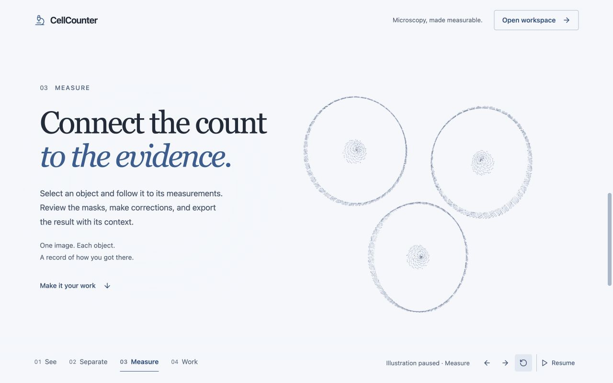

# CellCounter landing page: a continuous study

Direction written before the second landing-page implementation, 8 September
2026. This supersedes the boxed illustration layout in Web 0.2.0 while retaining
the [workbench principles](cellcounter-guide.md). The analysis application is
unchanged by this narrative surface.

## Intent and reference

The user approved the animation's visual quality but asked for a stronger
landing page, an unframed illustration that changes with scrolling, and a blend
of Astra and Datacurve appropriate to CellCounter. The exact Astra URL has been
requested and remains unresolved; do not attribute design decisions to an
uninspected Astra site.

[Datacurve](https://datacurve.ai/) was inspected in a browser on 8 September 2026.
Observed: a sparse header, large serif statements, a light canvas extending
across the page, and dense particle forms that transform alongside scroll-linked
copy. The useful lesson is continuity between composition, text and movement.
CellCounter should use a shorter narrative, immediately legible text and direct
access to the workbench. Its particle forms and copy must be original and about
microscopy; no Datacurve assets, logos, models or marketing language are copied.

## Visual direction

- One uninterrupted cool-white/very pale blue surface, charcoal text and muted
  instrument blue. No neon green, decorative card grid or split-screen dark
  rectangle around the animation.
- A single viewport-sized transparent 3D canvas belongs to the whole landing
  page. Keep it visible across scroll sections. Its forms, composition and
  camera position change with the scroll progress.
- Generous typographic scale with a restrained editorial serif for the central
  statement and a readable system sans for explanation, actions and navigation.
  Avoid a giant generic AI slogan. Say what CellCounter does.
- Alternate text placement and illustration density to create breathing room.
  Text remains fully legible at every scroll point; use spatial clearance and
  subtle opaque text backing if necessary, never low-opacity essential copy.
- Keep animation controls in a compact fixed utility strip rather than a panel.
  Navigation links skip directly to narrative sections. An Open workspace
  action remains available throughout.

## The story

| Stage | Message | Original illustrative form |
| --- | --- | --- |
| See | Look closely. Count with confidence. | A suspended, membrane-like cell with finer inner structure and a sparse surrounding field |
| Separate | Every cell deserves a closer look. | Several cell-like point clouds move apart into discernible objects |
| Measure | Connect the count to the evidence. | The same points organize into boundaries, centers and a measured spatial arrangement |
| Work | Your images. Your judgment. | A quiet, ordered point field frames the final action and the privacy/capability disclosure |

The story describes usable import/preview/review/export behavior. The animated
forms are explicitly an illustration, not model output, data from a microscopy
image, or a biological simulation. Avoid pretending to demonstrate actual
segmentation accuracy. State that browser classical segmentation is available
and browser learned weights are not yet bundled.

## Scroll and interaction contract

- Native scrolling controls continuous morph progress and camera/composition;
  there is no scroll capture, forced pause, wheel hijack or automatic page move.
- Keep the canvas pinned with sticky positioning inside the scroll container,
  so the canvas participates in native scrolling, while real semantic sections
  flow over it. Three or four useful sections are sufficient; do not demand
  dozens of empty viewport scrolls to reach the application.
- Dragging unobstructed space may rotate the scene. Visible rotation and reset
  buttons offer the same action; links/buttons/text keep normal pointer behavior.
- Section links and labeled stage controls provide alternatives to scrubbing.
  Pause freezes ambient motion and scroll-linked morphing; explicit stage
  changes still work. Reduced motion uses static stages with no scroll-driven
  animation. No information depends on particle motion.
- Mobile keeps the full-page illustration, with fewer particles and composition
  shifted away from text. No overflow, tiny essential copy or gesture trap.
- Preserve renderer lazy loading, capped pixel ratio/particles, background-tab
  pause, GPU cleanup on exit and a graceful no-WebGL state. The workbench must
  not wait for the scene or load it during an existing analysis session.

## Acceptance observations

Observed in the production preview on 8 September 2026:

- Desktop at 1280 × 800: native scrolling over the illustration moved the page
  from See to Separate. The canvas remained at the top of the viewport while
  the form and text composition changed. Sticky positioning corrected a
  native-scroll dead area caused by a fixed canvas.
- Pause held the Separate illustration while the text scrolled to Measure.
  The Measure link then selected boundaries without resuming animation.
  Rotation, reset, and stage navigation were exercised through visible controls.
- Phone layout at 390 × 844: no horizontal document overflow; first and final
  chapters retained readable copy, navigation and workspace access. The final
  ordered field sits below the longer disclosure text.
- Workspace entry removed the canvas; Help reopened the introduction. The app's
  waiting-update prompt applied the production update through its Reload action.
- Reduced-motion preference handling, background-tab suspension and the
  no-WebGL path were reviewed in code, not device-certified. No biological
  accuracy or GPU performance benchmark is implied by these observations.

The older Web 0.2.0 screenshots remain as release history.
